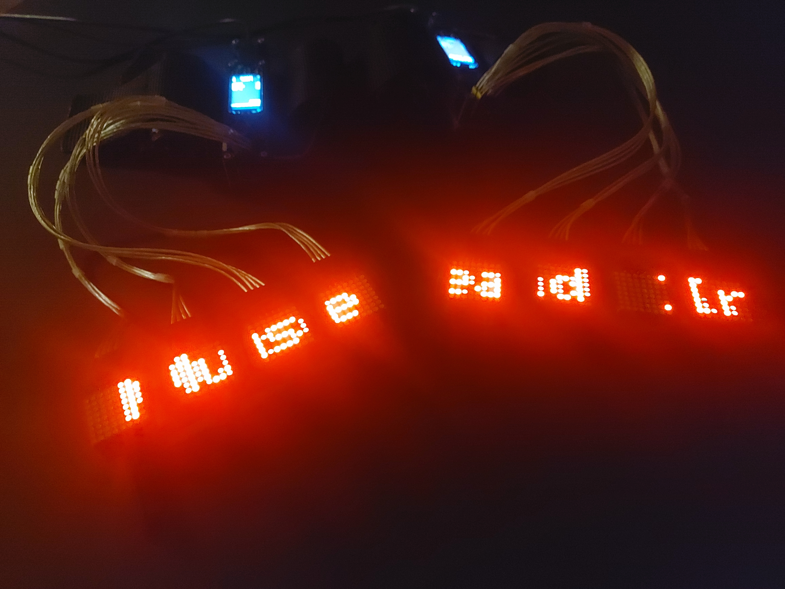
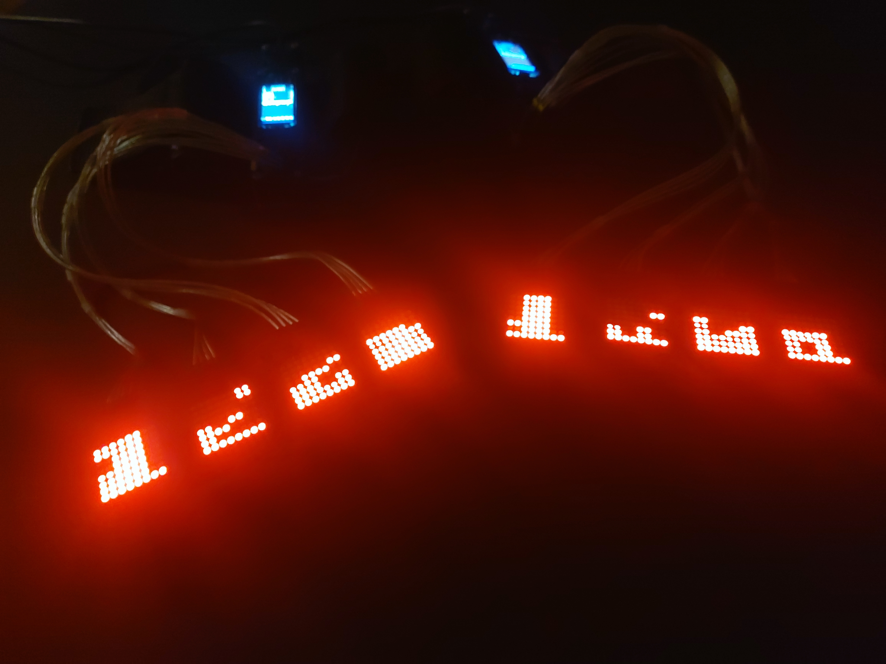
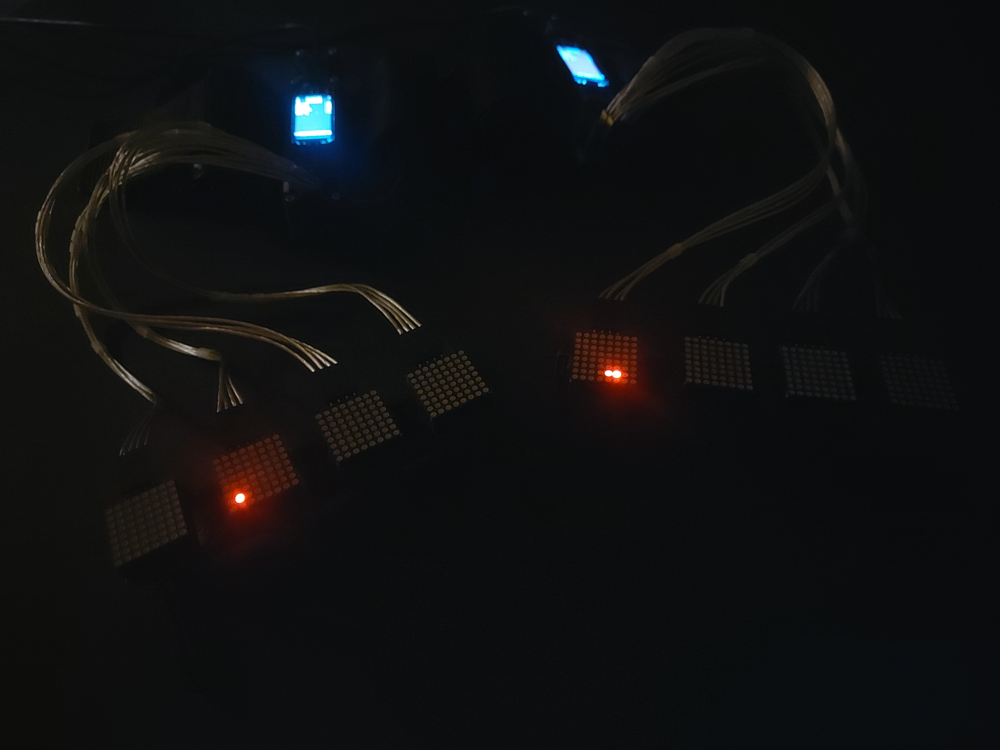

# letter-rings

This is a fun project primarily for learning things. Following a specific theme for a partyI had been invited to an image of letters on each finger came to my mind, think of "LOVE" across the fingers of one hand and "HATE" on the other to have you own picture.

Since - for reasons - I did not want this as a permanent solution, something else had to be found.

I came across [8x8 LED Matrix elements](https://www.adafruit.com/product/870), small enough to be fitted to single fingers and added 3D printed rings. Cables would lead from the LED Matrix elements to a hidden [microcontroller](https://learn.adafruit.com/esp32-s3-reverse-tft-feather/overview) on my forearms. I wanted to enable the device to interact with the music being played, so I added a [microphone](https://www.adafruit.com/product/1063) for frequency analysis as well as an [orientation sensor](https://www.adafruit.com/product/4646?srsltid=AfmBOoqnGDiWn61naHonwXmNlG8PC3zfjmaNAw2MefeWkbG_hBlhx19s) so the matrices could adapt to arm position.

To avoid cable mess I ordered a simple PCB and 3D printed more parts to keep everything together. USB cables will lead to a powerbank capable to run the entire setup for many hours.

</img>

Would be nice to sync left and right? To add Bluetooth and a central device to take control I wrote an Android app, my first such app and maybe the most challenging part of this project. This app is in charge of synchronizing modes across devices.

</img>

There a multiple modes of operation ...

- WORDS

This mode refers to the original theme, "letters" and shows opposing pairs of words on the led matrices in radid succesion.

</img>

- LABEL

The app integrates [shazamkit](https://developer.apple.com/shazamkit/android/) for music recognition. The Android app records 10 second samples, and asks the Shazam Api for title and artist. When recognizable, tile and artist are shown as moving labels on the led matrices.

</img>

- FREQU

In this mode the devices frequency analysis is performed every 50 milliseconds (20 times per second), and the frequencies are displayed in disco style bars.

</img>

- BREAK

This is a "silent" mode, i.e. for when a conversation happens. A single dot travels through the led matrices.

</img>

- ACCEL

Unfortunately no picture ... the orientation sensor records movements and upon detection of comment movement, i.e. both hands are held together, a PACMAN animation will run, consuming anything previously drawn on the matrices ;)
