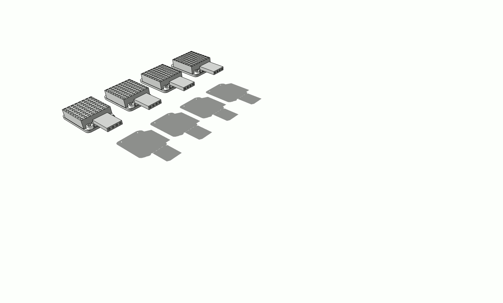
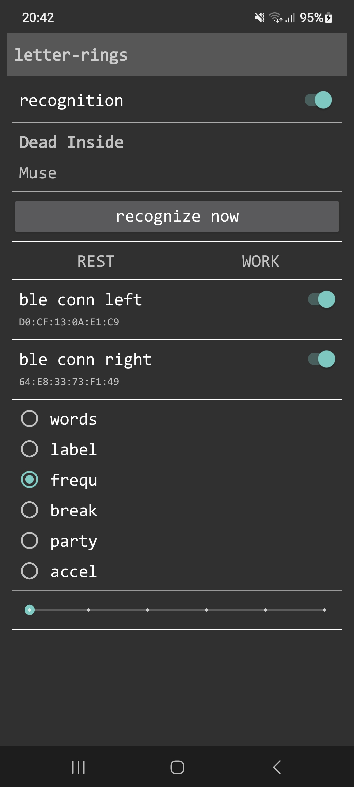

# letter-rings

This is a fun project primarily for learning things. Following a specific theme for a party an image of letters on each finger came to my mind, think of the "LOVE" across the fingers of one hand and "HATE" on the other to have you own picture.

Since - for reasons - I did not this as a permanent solution, something else had to be found.

I came across [8x8 LED Matrix elements](https://www.adafruit.com/product/870), small enough to be fitted to single fingers and added 3D printed rings. Cables would lead from the LED Matrix elements to a hidden [microcontroller](https://learn.adafruit.com/esp32-s3-reverse-tft-feather/overview) on my forearms. I wanted to enable the device to interact with the music being played, so I added a [microphone](https://www.adafruit.com/product/1063) for frequency analysis as well as an [orientation sensor](https://www.adafruit.com/product/4646?srsltid=AfmBOoqnGDiWn61naHonwXmNlG8PC3zfjmaNAw2MefeWkbG_hBlhx19s) so the matrices could adapt to arm position.

To avoid cable mess I ordered a simple PCB and 3D printed more parts to keep everything together. USB cables will lead to a powerbank capable to run the entire setup for many hours.

</img>

Would be nice to sync left and right? Add Bluetooth and a central device to take control, so I wrote an Android app, my first and maybe the most challenging part of this project. The app is in charge to synchronize modes across devices and it integrated [shazamkit](https://developer.apple.com/shazamkit/android/) for music recognition.

</img>

TODO :: description of device modes and associated picture
